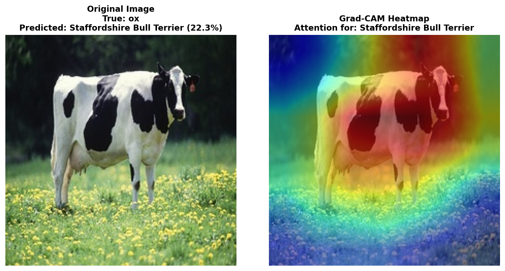
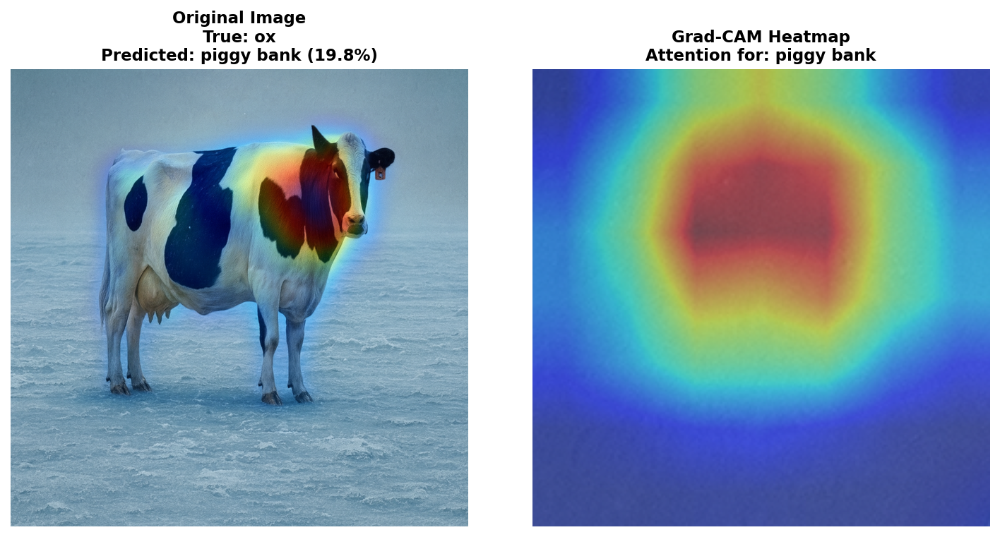

# Grad-CAM on High-Resolution Images

Interactive Grad-CAM visualization using **224×224 RGB images** from ImageNet with pretrained ResNet models.

## Features

- **High-Resolution Images**: 224×224 RGB (vs 32×32 or 28×28 in typical demos)
- **Curated Dataset**: 24 hand-picked ImageNet images
  - Cats (4 images): tabby, persian, siamese cats
  - Dogs (5 images): golden retriever, german shepherd, beagle, corgi
  - Birds (1 image): robin
  - Food (5 images): pizza, strawberry, banana, ice cream
  - Animals (5 images): elephant, zebra, tiger, panda, bear
  - **⚠️ Spurious Correlations (4 images)**: Separate category demonstrating background bias and shortcuts
- **2 Models**: ResNet18 (11M params) and ResNet50 (25M params)
- **Clean Interface**: Organized by category, easy image browsing
- **Human-Readable Labels**: Shows "golden retriever" instead of "Class 207"
- **Educational**: Step-by-step explanation of Grad-CAM algorithm + spurious correlations

## Installation

```bash
cd apps/gradcam-enhanced

# Install dependencies
pip install streamlit torch torchvision numpy matplotlib Pillow

# Download the curated ImageNet samples (20 images, ~2MB)
python download_imagenet_samples.py
```

## Usage

```bash
streamlit run app.py
```

Then:
1. Select model (ResNet18 or ResNet50)
2. Browse images by category or enter index
3. See Grad-CAM visualization showing which regions the model focuses on
4. Try different target classes to explore counterfactual explanations

## Dataset

The 20 curated images are downloaded from Wikimedia Commons and resized to 224×224.
Each image includes metadata with its ImageNet class ID and name.

Location: `imagenet_samples/`

## What is Grad-CAM?

**Gradient-weighted Class Activation Mapping** visualizes which regions of an image
are important for a neural network's prediction.

### Algorithm:

1. **Forward pass**: Extract feature maps from layer4 (7×7×512 for ResNet)
2. **Backward pass**: Compute gradients of target class w.r.t. feature maps
3. **Global average pooling**: Average gradients spatially to get channel weights
4. **Weighted sum**: Multiply feature maps by weights and sum across channels
5. **ReLU**: Keep only positive contributions
6. **Upsample**: Resize from 7×7 to 224×224 using bilinear interpolation
7. **Overlay**: Display as heatmap (jet colormap) on original image

**Red = high importance, Blue = low importance**

## Why 224×224?

- ImageNet standard: All ImageNet models are trained on 224×224 images
- Better spatial resolution: 7× more detail than 32×32 CIFAR images
- Clearer visualizations: Easier to see what the model focuses on
- Pretrained weights work at native resolution

## Examples

- **Cats**: Models focus on faces, especially eyes and ears
- **Dogs**: Attention on snouts, eyes, and distinctive breed features
- **Food**: Focus on textures and characteristic shapes
- **Vehicles**: Wheels, windows, and distinctive vehicle parts
- **Animals**: Distinctive features like stripes (zebra), tusks (elephant)

## Spurious Correlations (Why This Matters!)

The dataset includes examples that demonstrate a critical issue in deep learning: **spurious correlations**.

### Example: Cow with Different Backgrounds

Here's a striking example showing how background context completely confuses the model:

#### Cow in Field (Typical Setting)


**Result:** ResNet18 predicts "Staffordshire Bull Terrier" (22.3%)
- The model focuses on the black and white pattern
- Completely misses that it's a cow
- Background grass doesn't help - model learned wrong features

#### Cow on Ice/Snow (Unusual Setting)


**Result:** ResNet18 predicts "piggy bank" (19.8%) or "ski" (~15-20%)
- Even worse! The unusual snowy background completely confuses the model
- Common predictions: piggy bank, ski, king penguin - all related to snow/ice context!
- Grad-CAM shows the model focusing on ice/snow texture instead of the cow
- The model has never seen cows in this context during training
- **"ski" prediction is perfect example**: Model sees snow → predicts ski (spurious correlation!)

### What This Reveals

**Grad-CAM exposes the problem:**
- Models learn **shortcuts** based on typical training data contexts
- Background/texture matters more than the actual object features
- When context changes, models fail catastrophically
- The heatmaps show exactly where the model is looking (spoiler: the wrong places!)

### Why This Is Important

Spurious correlations are a major problem in real-world AI systems:
- **Medical imaging:** Models learning to detect equipment instead of diseases
- **Hiring:** Models learning irrelevant demographic signals
- **Security:** Models relying on background context instead of actual threats
- **Autonomous vehicles:** Misclassifying objects in unusual lighting/weather

**Grad-CAM helps us identify these issues** by visualizing what the model actually looks at!

## Citation

```bibtex
@inproceedings{selvaraju2017grad,
  title={Grad-CAM: Visual explanations from deep networks via gradient-based localization},
  author={Selvaraju, Ramprasaath R and Cogswell, Michael and Das, Abhishek and Vedantam, Ramakrishna and Parikh, Devi and Batra, Dhruv},
  booktitle={ICCV},
  year={2017}
}
```
